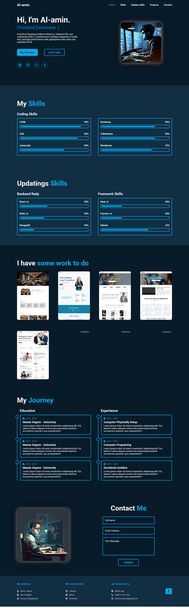

# My Responsive Website 🌐

This is my portfolio website built with **HTML, CSS, and JavaScript**.  
It works smoothly on all devices starting from **320px screens (small phones)** up to large desktops.  

---

## 🛠️ Technologies Used
- HTML5  
- CSS3 (Flexbox & Grid, Media Queries)  
- JavaScript (for interactivity)  

---

## 📱 Responsive Breakpoints
- `320px` → Small Mobile  
- `480px` → Medium Mobile  
- `768px` → Tablets  
- `1024px` → Small Laptops  
- `1200px+` → Desktops  

---

## 💡 Features
- Mobile-first responsive design  
- Smooth navigation menu (mobile + desktop)  
- Interactive sections with JavaScript  
- Clean and modern UI  

---
## 📁My project structure
my-project/
│
├── images/
    ├── project_images/
    ├── favicon.png
    └── avater.jpg
├── index.html
├── my_resume.rar
├── script.js
└── style.css
    

---

  ## 🧑‍💻 How to Run Locally
  1. Clone the repo:
     ```bash
     git clone https://github.com/alamin-codes/portfolio.git
     ```
---

## 🚀 Live Demo  
🔗 [Click here to view live project](https://alamin-codes.github.io/portfolio/)  

---

## 📸 Preview Screenshot


---